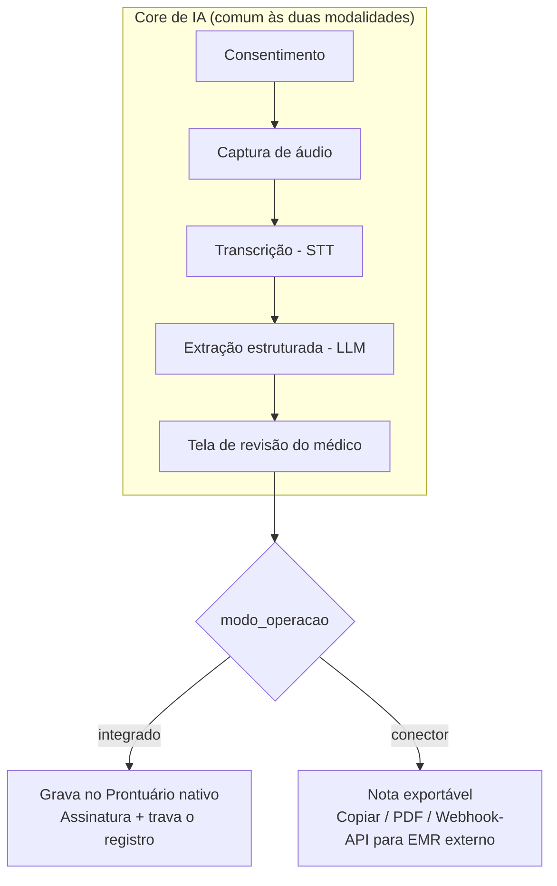
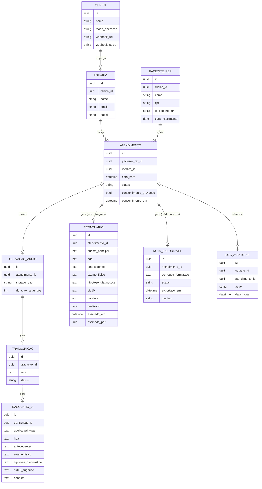

# Especificação Funcional — MVP Prontuário IA

> Status: **Aguardando aprovação**
> Versão: 0.2 — inclui as duas modalidades de operação (integrado / conector)

## 1. Objetivo do produto

Sistema web que utiliza IA para ouvir a consulta médica e pré-preencher o formulário de atendimento, reduzindo o tempo gasto pelo médico em documentação clínica, mantendo sempre a revisão e assinatura humana como etapa obrigatória — disponível em duas modalidades de operação (ver seção 2).

## 2. Duas modalidades de operação

O MVP contempla **dois modos de operação**, compartilhando o mesmo *core* de IA (consentimento, captura de áudio, transcrição, extração estruturada). A diferença está na camada de persistência/saída da nota gerada:

| | **Modalidade A — Integrado** | **Modalidade B — Conector (add-on para EMR externo)** |
|---|---|---|
| Analogia de mercado | Prontuário completo próprio | Modelo TuriSaúde/Voa Health: a IA não substitui o EMR do cliente |
| Onde o prontuário "definitivo" vive | No nosso banco (PostgreSQL) | No EMR já usado pela clínica |
| Cadastro de paciente | Completo, nativo | Mínimo (referência ao paciente do EMR externo, por ID/CPF) |
| Saída da IA | Grava direto no prontuário nativo, após revisão | Nota clínica revisável, depois **exportada** (copiar, PDF/DOCX, ou envio via webhook/API para o EMR do cliente) |
| Assinatura/finalização | Ocorre no nosso sistema | Ocorre no EMR de destino; nosso sistema apenas marca a nota como "exportada" |
| Quando faz sentido | Consultório sem EMR, ou disposto a migrar | Clínica já tem EMR consolidado e só quer a camada de IA |

A escolha do modo é uma **configuração por clínica/consultório** (`modo_operacao`: `integrado` | `conector`), definida no cadastro inicial da clínica. O pipeline de IA (captura → consentimento → transcrição → extração estruturada) é **idêntico** nos dois modos; o que muda é apenas o que acontece depois da revisão do médico.

## 3. Escopo do MVP

### 3.1 Comum às duas modalidades (core de IA)

- Cadastro e autenticação de usuários (Médico, Administrador).
- Abertura de atendimento/consulta.
- Gravação de áudio da consulta (com tela de consentimento do paciente).
- Transcrição do áudio.
- Extração por IA dos campos do formulário a partir da transcrição:
  - Queixa principal
  - História da doença atual (HDA)
  - Antecedentes relevantes citados na consulta
  - Exame físico (quando verbalizado)
  - Hipótese diagnóstica (sugestão de CID-10)
  - Conduta / prescrição
- Tela de revisão: médico vê a sugestão da IA lado a lado com o campo editável, aceita/edita/rejeita cada trecho.
- Log de auditoria de acesso a dados de saúde (LGPD).

### 3.2 Exclusivo da Modalidade A — Integrado

- Cadastro completo de pacientes (dados pessoais + histórico clínico básico).
- Prontuário nativo, com assinatura e finalização (bloqueia edição posterior, gera trilha de auditoria).
- Histórico de atendimentos por paciente.

### 3.3 Exclusivo da Modalidade B — Conector

- Cadastro mínimo de paciente (referência externa: ID ou CPF vindo do EMR do cliente) — sem duplicar todo o cadastro clínico.
- Exportação da nota revisada em pelo menos um formato: copiar texto formatado, baixar PDF, **ou** enviar via webhook/API para um endpoint configurado pela clínica.
- Marcação de status da nota: rascunho → revisada → exportada.
- Configuração, por clínica, do(s) destino(s) de exportação (ex.: um webhook HTTP; ou apenas modo manual copiar/baixar no MVP).

### 3.4 Fora do escopo (backlog pós-MVP)

- Agenda/agendamento de consultas.
- Faturamento, convênios e TISS.
- Emissão de receita com assinatura digital certificada (ICP-Brasil).
- Templates por especialidade (cardiologia, pediatria etc.) — MVP usa um template único genérico (SOAP).
- Aplicativo mobile nativo.
- Telemedicina (vídeo).
- Transcrição em tempo real durante a fala (MVP processa em lote, ao final da gravação).
- Múltiplas clínicas simultâneas com um mesmo médico (MVP é single-tenant por instalação).
- Integrações nativas com EMRs específicos de mercado na Modalidade B (MVP oferece um webhook genérico + export manual; conectores prontos para EMRs específicos ficam para depois).

## 4. Personas

- **Médico**: usuário principal, realiza a consulta, revisa e (na Modalidade A) assina o prontuário ou (na Modalidade B) confirma e exporta a nota.
- **Administrador**: gerencia usuários, pacientes/referências e configuração do modo de operação e destinos de exportação; acessa logs de auditoria (não acessa conteúdo clínico sem justificativa).

## 5. Fluxo principal (user journey)

1. Médico faz login.
2. Médico seleciona o paciente (cadastro completo na Modalidade A; referência ao EMR externo na Modalidade B).
3. Médico inicia um novo atendimento.
4. Sistema exibe tela de **consentimento** — confirma que a consulta será gravada para fins de documentação.
5. Médico inicia a gravação (áudio capturado no navegador).
6. Ao final da consulta, médico encerra a gravação; o áudio é enviado ao backend.
7. Backend processa de forma assíncrona: transcreve o áudio → envia a transcrição à IA de extração → gera um rascunho estruturado.
8. Médico é notificado (via SignalR/tela) quando o rascunho está pronto.
9. Médico revisa o rascunho campo a campo, edita o que for necessário.
10. **Modalidade A**: médico assina/finaliza o prontuário — sistema trava o registro e grava log de auditoria; prontuário fica no histórico do paciente.
    **Modalidade B**: médico confirma a nota e escolhe exportar (copiar/baixar/enviar via webhook) — sistema marca a nota como exportada e grava log de auditoria.

**Regra de ouro**: a IA nunca salva/envia o prontuário ou a nota sozinha. Toda sugestão passa por revisão humana antes da confirmação, nas duas modalidades.

## 6. Requisitos funcionais

### 6.1 Core (ambas as modalidades)

| ID | Requisito |
|---|---|
| RF01 | O sistema deve permitir login de usuários com e-mail/senha e emissão de JWT. |
| RF02 | O sistema deve suportar os papéis Médico e Administrador com permissões distintas. |
| RF03 | O sistema deve permitir configurar, por clínica, o `modo_operacao` (`integrado` ou `conector`). |
| RF04 | O sistema deve permitir abrir um novo atendimento vinculado a um paciente (ou referência de paciente) e a um médico. |
| RF05 | O sistema deve exibir uma tela de consentimento antes de permitir a gravação de áudio, registrando data/hora da aceitação. |
| RF06 | O sistema deve capturar áudio pelo navegador e enviá-lo ao backend de forma segura (HTTPS). |
| RF07 | O sistema deve transcrever o áudio da consulta. |
| RF08 | O sistema deve extrair, a partir da transcrição, um rascunho estruturado com: queixa principal, HDA, antecedentes, exame físico, hipótese diagnóstica (CID-10 sugerido) e conduta. |
| RF09 | O sistema deve apresentar o rascunho gerado pela IA em uma tela de revisão editável, campo a campo. |
| RF10 | O sistema deve permitir ao médico aceitar, editar ou apagar qualquer trecho sugerido pela IA antes de confirmar. |
| RF11 | O sistema deve registrar log de auditoria (quem acessou, quando, qual paciente/registro) para cada leitura ou escrita de dado clínico. |
| RF12 | O sistema deve notificar o médico em tempo real quando o processamento de IA de um atendimento for concluído. |
| RF13 | O sistema deve permitir reprocessar a transcrição/extração em caso de falha, sem duplicar o atendimento. |

### 6.2 Modalidade A — Integrado

| ID | Requisito |
|---|---|
| RF14 | O sistema deve permitir CRUD de pacientes (nome, CPF, data de nascimento, contato, histórico clínico resumido). |
| RF15 | O sistema deve permitir a assinatura/finalização do prontuário, tornando-o somente leitura após finalizado. |
| RF16 | O sistema deve manter histórico de atendimentos por paciente, ordenado por data. |

### 6.3 Modalidade B — Conector

| ID | Requisito |
|---|---|
| RF17 | O sistema deve permitir cadastrar uma referência mínima de paciente (ID externo e/ou CPF) sem exigir o cadastro clínico completo. |
| RF18 | O sistema deve permitir exportar a nota revisada como texto copiável e/ou arquivo PDF. |
| RF19 | O sistema deve permitir configurar um webhook por clínica para envio automático da nota exportada (payload JSON). |
| RF20 | O sistema deve manter o status da nota (`rascunho` → `revisada` → `exportada`) e a data/hora de cada transição. |

## 7. Requisitos não funcionais

| ID | Requisito |
|---|---|
| RNF01 | Todo tráfego entre cliente e servidor deve usar HTTPS/TLS. |
| RNF02 | Dados sensíveis de saúde devem ser armazenados criptografados em repouso. |
| RNF03 | O sistema deve estar em conformidade com a LGPD para dados de saúde (base legal, consentimento, direito de acesso/exclusão). |
| RNF04 | O tempo entre o fim da gravação e a disponibilização do rascunho da IA deve ser, no MVP, de até 2 minutos para consultas de até 20 minutos de áudio. |
| RNF05 | O ambiente completo (frontend, backend, banco, storage) deve subir localmente via `docker compose up`, nas duas modalidades. |
| RNF06 | O sistema deve manter trilha de auditoria imutável (não editável/apagável por usuários da aplicação). |
| RNF07 | O backend deve expor os provedores de STT e LLM por trás de interfaces, permitindo troca de fornecedor sem alterar a camada de domínio. |
| RNF08 | Falha no serviço de IA não pode impedir o preenchimento manual do formulário, em nenhuma das modalidades. |
| RNF09 | A troca de modalidade (`integrado`/`conector`) deve ser uma configuração, não exigir código ou deploy separado por cliente. |
| RNF10 | O webhook de exportação (Modalidade B) deve ter mecanismo de assinatura/segredo compartilhado para autenticar o destino. |

## 8. Modelo de dados (visão MVP)

Observações:
- `PACIENTE_REF` substitui o antigo `PACIENTE`: na Modalidade A ele carrega o cadastro completo; na Modalidade B carrega apenas a referência mínima ao paciente do EMR externo.
- `RASCUNHO_IA` nunca sobrescreve `PRONTUARIO` (Modalidade A) nem `NOTA_EXPORTAVEL` (Modalidade B) diretamente — a cópia só ocorre após a revisão do médico (RF10).
- Somente uma das entidades `PRONTUARIO`/`NOTA_EXPORTAVEL` é usada por atendimento, conforme o `modo_operacao` da clínica.

## 9. Arquitetura técnica

- **Frontend**: Angular (última versão LTS), Angular Material, RxJS, `MediaRecorder API` para captura de áudio, `@microsoft/signalr` para status em tempo real. Telas de cadastro completo de paciente e de configuração de exportação são condicionais ao `modo_operacao` da clínica logada.
- **Backend**: ASP.NET Core Web API (.NET 8), Clean Architecture (`Domain`, `Application`, `Infrastructure`, `Api`), ASP.NET Identity + JWT, `BackgroundService`/Hangfire para o worker de IA, SignalR Hub para notificações.
- **Camada de saída desacoplada**: interface `IRegistroClinicoOutput` com duas implementações — `ProntuarioNativoOutput` (Modalidade A) e `ExportacaoEmrOutput` (Modalidade B, com estratégias de copiar/PDF/webhook). O `Application` layer decide a implementação a partir do `modo_operacao` da clínica.
- **Banco de dados**: PostgreSQL 16, migrations via EF Core.
- **Armazenamento de áudio**: MinIO (S3-compatible) em dev/homologação.
- **IA**:
  - `ITranscriptionService` — provedor de STT em nuvem com suporte a português (a decidir em spike técnico: Azure Speech / Google Cloud STT / Whisper API).
  - `IClinicalNoteGenerator` — LLM com prompt estruturado (JSON schema) para extrair os campos a partir da transcrição — **igual nas duas modalidades**.
- **Orquestração local**: Docker Compose com serviços `frontend`, `backend`, `worker`, `postgres`, `minio`.
- **Observabilidade mínima do MVP**: logs estruturados no backend + tabela de auditoria no Postgres.

## 10. Segurança e conformidade (LGPD/CFM)

- Consentimento explícito antes de qualquer gravação (RF05), com registro de data/hora — nas duas modalidades.
- Controle de acesso por papel (RF02); médico só acessa pacientes/atendimentos dos quais participa (regra a validar com o negócio para clínicas com múltiplos médicos).
- Log de auditoria imutável de todo acesso a dado clínico (RF11/RNF06).
- Modalidade A: prontuário finalizado é somente leitura (RF15) — alterações posteriores exigem adendo, não edição do registro original.
- Modalidade B: nota exportada é somente leitura; o registro legal definitivo passa a ser responsabilidade do EMR de destino a partir da exportação — isso deve ficar explícito em termo de uso/contrato com a clínica.
- Dados sensíveis criptografados em repouso (RNF02), incluindo o `webhook_secret` da Modalidade B.
- Direito do titular (paciente) de solicitar acesso/exclusão dos seus dados — processo pode ser manual no MVP (via administrador), desde que documentado.

## 11. Critérios de aceite do MVP

### Comuns
- [ ] Médico realiza login e vê apenas os dados a que tem direito.
- [ ] Sistema exige consentimento antes de gravar áudio.
- [ ] Áudio é gravado, enviado e transcrito com sucesso.
- [ ] Rascunho estruturado é gerado pela IA e exibido na tela de revisão.
- [ ] Toda ação sobre dado clínico gera entrada no log de auditoria.
- [ ] `docker compose up` sobe o ambiente completo localmente, em qualquer `modo_operacao`.
- [ ] Falha do serviço de IA não impede preenchimento manual do formulário.

### Modalidade A — Integrado
- [ ] Médico cadastra paciente completo e abre atendimento.
- [ ] Médico edita e finaliza o prontuário; registro fica travado após assinatura.
- [ ] Histórico de atendimentos do paciente é consultável.

### Modalidade B — Conector
- [ ] Médico abre atendimento referenciando um paciente por ID externo/CPF, sem cadastro completo.
- [ ] Médico revisa e confirma a nota; consegue copiar o texto ou baixar PDF.
- [ ] Quando um webhook está configurado, a nota exportada é enviada e o status muda para `exportada`.

## 12. Abertos para decisão (a resolver antes/no início do desenvolvimento)

1. Fornecedor de STT e de LLM (custo, acurácia em português clínico, hospedagem dos dados — preferência por provedores com data residency adequado à LGPD).
2. Transcrição em lote (ao final da gravação) vs. streaming em tempo real — MVP assume **lote** por simplicidade; avaliar streaming em fase futura.
3. Regra de acesso multi-médico (um médico vê só seus pacientes, ou todos da clínica).
4. Política de retenção do áudio bruto (guardar por quanto tempo? apagar após transcrição confirmada?).
5. Necessidade de assinatura digital certificada (ICP-Brasil) já no MVP ou pós-MVP (Modalidade A).
6. Formato exato do payload do webhook da Modalidade B (JSON simples proprietário no MVP, ou já mirar em HL7 FHIR `DocumentReference`?).
7. Se o MVP entrega as duas modalidades **em paralelo** desde o início, ou entrega o core + Modalidade A primeiro e adiciona a camada de exportação (Modalidade B) em seguida — ver plano de desenvolvimento, seção de fases.

## 13. Aprovação

| Papel | Nome | Aprovado em |
|---|---|---|
| Product Owner | | |
| Responsável técnico | | |
| Revisor clínico | | |
