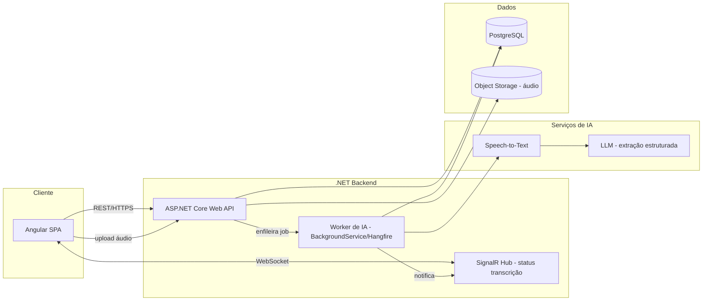

# Plano de Desenvolvimento — Prontuário IA (MVP)

## 1. Contexto e objetivo

Construir um **prontuário eletrônico (EMR)** para consultórios/clínicas que seja capaz de:

1. Gravar/ouvir a consulta médica (com consentimento do paciente);
2. Transcrever o áudio da consulta;
3. Usar IA para estruturar a transcrição e **pré-preencher automaticamente** o formulário de atendimento (queixa principal, HDA, exame físico, hipótese diagnóstica, conduta, prescrição);
4. Permitir que o médico revise, edite e assine o prontuário antes de salvar.

Stack definida pelo negócio: **Angular** (frontend), **.NET** (backend), **PostgreSQL** (banco de dados), **Docker** (empacotamento/orquestração local).

## 2. Referências de mercado

| Produto | O que é | O que **não** é |
|---|---|---|
| [TuriSaúde](https://turisaude.com.br/) | Assistente de IA que transcreve a consulta em tempo real e gera nota clínica, receitas, pedidos de exame e laudos a partir de modelos por especialidade. | Não é um prontuário eletrônico completo — é usado **em conjunto** com o EMR do consultório. |
| [Voa Health](https://voa.health/) | "Ambient AI scribe": ouve a consulta, gera anamnese/nota clínica estruturada seguindo o estilo do médico e templates por especialidade (ex.: cardiologia, insuficiência cardíaca). | Também não é um EMR — a nota gerada precisa ser inserida manualmente no prontuário do consultório. |

**Diferencial do nosso MVP**: o mesmo *core* de IA (escuta/transcrição/preenchimento) atende **dois modelos de negócio**:

- **Modalidade A — Integrado**: prontuário completo próprio (cadastro de paciente, histórico, assinatura) — para quem não tem EMR ou quer trocar.
- **Modalidade B — Conector**: a IA funciona como add-on que gera a nota clínica e a exporta (cópia/PDF/webhook) para o EMR que a clínica já usa — o mesmo modelo do TuriSaúde/Voa Health.

Isso amplia o mercado endereçável: atende tanto quem quer um EMR novo quanto quem só quer a camada de IA sobre o sistema que já tem. Detalhes em `especificacao-mvp.md`, seção 2.

## 3. Arquitetura de alto nível

- **Frontend (Angular)**: SPA com Angular Material, captura de áudio via `MediaRecorder`, tela de atendimento com formulário estruturado (estilo SOAP), acompanhamento em tempo real do status da transcrição via WebSocket (SignalR). Telas de cadastro completo de paciente/assinatura (Modalidade A) e de configuração de exportação/webhook (Modalidade B) são exibidas conforme o `modo_operacao` da clínica.
- **Backend (.NET 8, Clean Architecture)**: `Domain` / `Application` / `Infrastructure` / `Api`. Autenticação JWT + ASP.NET Identity, controllers REST, `BackgroundService` (ou Hangfire) para orquestrar o pipeline de IA de forma assíncrona.
- **Pipeline de IA** abstraído por interfaces (`ITranscriptionService`, `IClinicalNoteGenerator`) para permitir trocar de provedor (ex.: Whisper/Azure Speech para STT; Claude/GPT para extração estruturada) sem reescrever o domínio.
- **Camada de saída desacoplada** (`IRegistroClinicoOutput`): implementação `ProntuarioNativoOutput` para a Modalidade A e `ExportacaoEmrOutput` (copiar/PDF/webhook) para a Modalidade B, selecionada por configuração da clínica — o core de captura/IA não muda entre as duas.
- **PostgreSQL**: dados estruturados (pacientes, consultas, prontuários, transcrições, logs de auditoria).
- **Object storage** (MinIO em dev, S3-compatível em produção): arquivos de áudio — não ficam no Postgres.
- **Docker Compose**: orquestra frontend, backend, worker, postgres, minio (e redis, se necessário para filas) no ambiente local/homologação.

## 4. Fases do MVP

Estratégia recomendada: construir o **core** (fases 0–4) já com a camada de saída abstraída (`IRegistroClinicoOutput`), entregar primeiro a **Modalidade A completa** (é a que exercita o produto ponta a ponta) e, na sequência, acrescentar a **Modalidade B** como uma segunda implementação dessa interface — o esforço extra dela é pequeno porque reaproveita 100% da captura/transcrição/IA.

| Fase | Entregas | Duração estimada |
|---|---|---|
| **0 — Fundação** | Repositórios, solution .NET (Clean Architecture), workspace Angular, docker-compose base, CI (build+test), migrations iniciais no Postgres, modelagem de `Clinica.modo_operacao` | 1 semana |
| **1 — Identidade e cadastro** | Login/JWT, papéis (Médico, Admin), CRUD de profissionais, cadastro de clínica com `modo_operacao` | 1,5 semana |
| **2 — Atendimento (sem IA)** | Criar/consultar atendimento, formulário estruturado manual (SOAP) | 1,5 semana |
| **3 — Captura e transcrição** | Gravação de áudio no navegador com consentimento explícito, upload, armazenamento, integração com STT, exibição da transcrição bruta | 2 semanas |
| **4 — Preenchimento por IA** | Pipeline LLM que extrai campos estruturados da transcrição, pré-preenche o formulário, tela de revisão/diff antes de confirmar | 2 semanas |
| **5 — Modalidade A: Integrado** | Cadastro completo de paciente, histórico por paciente, assinatura/finalização do prontuário, trava de edição | 1 semana |
| **6 — Modalidade B: Conector** | Referência mínima de paciente (ID externo/CPF), exportação da nota (copiar/PDF), configuração e disparo de webhook por clínica | 1,5 semana |
| **7 — Segurança, LGPD e hardening** | Log de auditoria de acesso, criptografia de dados sensíveis, retenção/expurgo, testes de carga leve, ajustes finais | 1,5 semana |
| **8 — Deploy e homologação** | Ambiente de homologação via Docker (ambas modalidades), documentação, piloto com clínica em cada modo | 1 semana |

**Total estimado: ~13 semanas** com 2 desenvolvedores full-stack (ou 1 back + 1 front) + apoio de um revisor clínico para validar os templates. Se o negócio preferir validar mais rápido, dá para lançar o piloto só com a Modalidade A ao final da fase 5 (~9 semanas) e tratar a fase 6 como incremento imediatamente depois.

## 5. Equipe sugerida

- 1 dev backend (.NET) sênior/pleno
- 1 dev frontend (Angular) pleno
- 1 revisor clínico (médico consultor) para validar campos do formulário e qualidade da extração da IA — meio período
- Apoio de DevOps pontual para pipeline de deploy

## 6. Riscos e mitigação

| Risco | Impacto | Mitigação |
|---|---|---|
| Dados de saúde são dado sensível (LGPD Art. 5º, II) | Alto | Consentimento explícito antes de gravar; criptografia; controle de acesso por papel; log de auditoria desde o MVP |
| Precisão da transcrição/extração de termos médicos | Alto | Vocabulário/prompt especializado; tela de revisão obrigatória pelo médico antes de salvar (IA nunca salva sozinha) |
| Custo variável de STT/LLM por consulta | Médio | Abstrair provedor via interface; medir custo por consulta desde o piloto; permitir modo "sem IA" (fallback manual) |
| Latência do pipeline de IA | Médio | Processamento assíncrono (worker + SignalR) — médico não fica bloqueado esperando |
| Regulamentação de prontuário eletrônico (CFM) | Alto | Assinatura do prontuário pelo médico como etapa obrigatória; trilha de auditoria; não usar IA como decisão clínica autônoma |
| Escopo inflar para "EMR completo" (faturamento, agenda, TISS) | Médio | Congelar escopo do MVP nas seções 3–4 da especificação; demais itens ficam no backlog pós-MVP |

## 7. Critérios de sucesso do MVP

- **Modalidade A**: um médico consegue realizar uma consulta ponta a ponta: abrir atendimento → gravar/ouvir a consulta → revisar sugestão da IA → editar → assinar o prontuário.
- **Modalidade B**: um médico consegue abrir atendimento referenciando um paciente do EMR externo → gravar → revisar a nota → exportá-la (copiar/PDF/webhook) com sucesso.
- Tempo de preenchimento do prontuário/nota reduzido em relação ao preenchimento 100% manual (meta: ≥ 30% de redução no piloto), nas duas modalidades.
- Zero incidente de vazamento de dado de saúde durante o piloto.
- Prontuário/nota final sempre reflete revisão humana (nenhum campo é salvo/exportado sem possibilidade de edição pelo médico).
- Trocar o `modo_operacao` de uma clínica é uma operação de configuração, sem exigir deploy ou build separado.

## 8. Próximos passos após aprovação

1. Validar a especificação (`especificacao-mvp.md`) com stakeholders.
2. Escolher fornecedor de STT e de LLM (custo x acurácia em português clínico).
3. Iniciar Fase 0 (fundação) do repositório.
